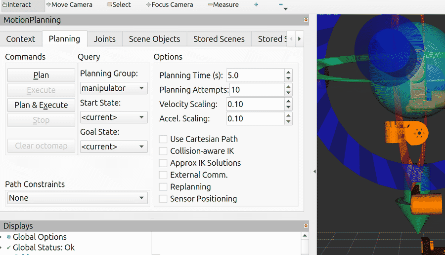

<div align="center">

# miku-arm-ros2

**ROS 2 Jazzy driver and control stack for a 6-axis Damiao-motor arm with a gripper**

<sub>KDL inverse kinematics · gravity compensation · trajectory replay and teaching · ArUco / RealSense pose estimation</sub>

[](https://docs.ros.org/en/jazzy/)
[](#build)
[](#build)
[](LICENSE)

[Build](#build) &nbsp;•&nbsp; [Hardware](#with-hardware) &nbsp;•&nbsp; [Simulation](#without-hardware) &nbsp;•&nbsp; [Verification](#verification) &nbsp;•&nbsp; [Docs](#documentation)

*English &nbsp;|&nbsp; [中文](README_CN.md)*

</div>

<p align="center">
  
</p>

*Recorded teach path replayed in simulation: mesh from the URDF, poses from `/joint_states`
during playback. 50 s at 100 Hz.*

<p align="center">
  
</p>

*Planning and execution from the RViz2 MotionPlanning panel: MoveIt plans a trajectory for
`manipulator`, `trajectory_bridge` converts it to `ArmMsg(mode=2)`, and the simulated arm follows
it. Playback is slowed to 0.18× for recording; the run reaches the goal within 0.01 rad.*

The arm is six Damiao motors and a gripper on one MCU board, driven over `/dev/ttyACM0` with a
50-byte down / 46-byte up binary protocol.

| | |
|---|---|
| **Packages** | `arm_control` · `hardware` · `deep_camera` · `aruco` · `miku_dummy` · `miku_dummy_moveit_config` · `miku_sim` · `miku_moveit_demo` |
| **Control** | KDL FK/IK, straight-line interpolation, six-channel gravity compensation, 4-state gripper FSM |
| **Modes** | `mode=1` MIT (stiffness, damping, torque feed-forward) · `mode=2` velocity-limited position |
| **Simulation** | no hardware required — simulated motors and a protocol-level driver-board peer |
| **Provenance** | ported from ROS 1 Noetic; the original workspace is in [`reference/`](reference/) |

## Build

Requires Ubuntu 24.04 and ROS 2 Jazzy.

```bash
source /opt/ros/jazzy/setup.bash
git clone https://github.com/p20030920p/miku-arm-ros2.git
cd miku-arm-ros2
colcon build --symlink-install
source install/setup.bash
```

## With hardware

Start the model display and the serial node, then choose a controller:

```bash
ros2 launch miku_dummy display.launch.py     # robot_state_publisher + RViz2
ros2 run hardware hardware                   # serial node
```

```bash
# keyboard-driven Cartesian targets
ros2 run arm_control arm_control_node

# hand-guided teaching: gravity compensation only, kp = 0
ros2 run arm_control teach_one_node

# replay a recorded trajectory from hardware/teach_path
ros2 run hardware trajectory_track
```

The serial device defaults to `/dev/ttyACM0` at 115200 baud and can be overridden:

```bash
ros2 run hardware hardware --ros-args -p serial_port:=/dev/ttyACM1
```

`./launch_hardware.sh`, `./launch_arm_teach_one_node.sh` and `./launch_claw_test.sh` wrap these
sequences and home the arm on exit.

## Without hardware

Start the simulated arm, then drive it with the same controller nodes:

```bash
ros2 launch miku_sim sim.launch.py           # simulated motors + RViz2
ros2 run hardware trajectory_track           # replay a recorded trajectory
```

### Planning with MoveIt 2

```bash
ros2 launch miku_moveit_demo moveit_demo.launch.py
```

This brings up the simulated motors, `move_group`, `trajectory_bridge` and RViz2. Drag the
interactive marker in the 3D view to set a goal, then use **Plan** and **Execute** in the
MotionPlanning panel. `trajectory_bridge` publishes the trajectory as `ArmMsg(mode=2)` on
`/Arm_tx` at 50 Hz; `speed_scale:=0.2` slows playback for demonstration, and `record:=true`
switches RViz to the single-panel layout used for recording.

`miku_sim` provides two substitutes, covering different layers:

- **`sim_motor_board`** replaces the driver board on the ROS side and publishes `/joint_states`,
  closing the control loop in simulation.
- **`virtual_motor_board.py`** implements the driver board's side of the wire — `0x86C1` / `0x86C2`
  framing, field offsets, the ×1000 fixed point. Over a `socat` PTY it exercises the serial protocol
  by running the real `hardware` binary against it.


The controller does not use MoveIt or `ros2_control`; it runs its own KDL kinematics and commands
the motors in MIT mode.

## Verification

```bash
ros2 run miku_sim run_serial_hil_test.sh     # serial protocol, 7 checks
ros2 run miku_sim run_sim_e2e_test.sh        # control pipeline, 6 checks
```

| Serial protocol | Result |
|---|---|
| Board init, bidirectional frame flow | pass |
| Six-joint setpoint accuracy | < 0.002 rad |
| MIT torque feed-forward, sign and magnitude | pass |
| Gravity droop removed by feed-forward | pass |
| Gripper stalls on contact | pass |
| Board unplugged mid-run | node survives |

| Control pipeline | Result |
|---|---|
| `/joint_states` rate | 100 Hz |
| TF tree `base_link → link_6` | complete |
| IK closed loop moves the arm | pass |
| Gravity-compensated hover drift | 0.0000 rad |
| Recorded teach file replays | 7 325 points |
| Gripper FSM reaches *grasped* | pass |

See [`docs/TESTING.md`](docs/TESTING.md) for what each check asserts and which parts are not
covered.

## Packages

| Package | Contents |
|---|---|
| `arm_control` | kinematics, gravity compensator, linear planner, gripper FSM, control nodes |
| `hardware` | serial node, trajectory replay, teaching recorder, test nodes |
| `miku_sim` | simulated motors, virtual driver board, both test suites |
| `deep_camera` | RealSense RGB-D capture and ArUco pose estimation |
| `aruco` | ArUco detector, ROS 2 node, marker-production files |
| `miku_dummy` | URDF, meshes, RViz2 configuration |
| `miku_dummy_moveit_config` | MoveIt 2 configuration (SRDF, planner parameters) |
| `miku_moveit_demo` | MoveIt 2 + RViz2 planning demo, trajectory bridge to `ArmMsg` |

## Documentation

| | |
|---|---|
| [`docs/OVERVIEW.md`](docs/OVERVIEW.md) | control pipeline, topics, simulation design |
| [`docs/PORTING.md`](docs/PORTING.md) | ROS 1 → ROS 2 mapping rules |
| [`docs/TESTING.md`](docs/TESTING.md) | test suites, coverage and gaps |
| [`docs/RECORDING.md`](docs/RECORDING.md) | recording demos |
| [`CHANGELOG.md`](CHANGELOG.md) | release history |

## License

MIT. The bundled ArUco detector is MIT, © 2017 Tentone — see [`src/aruco/LICENSE`](src/aruco/LICENSE).
