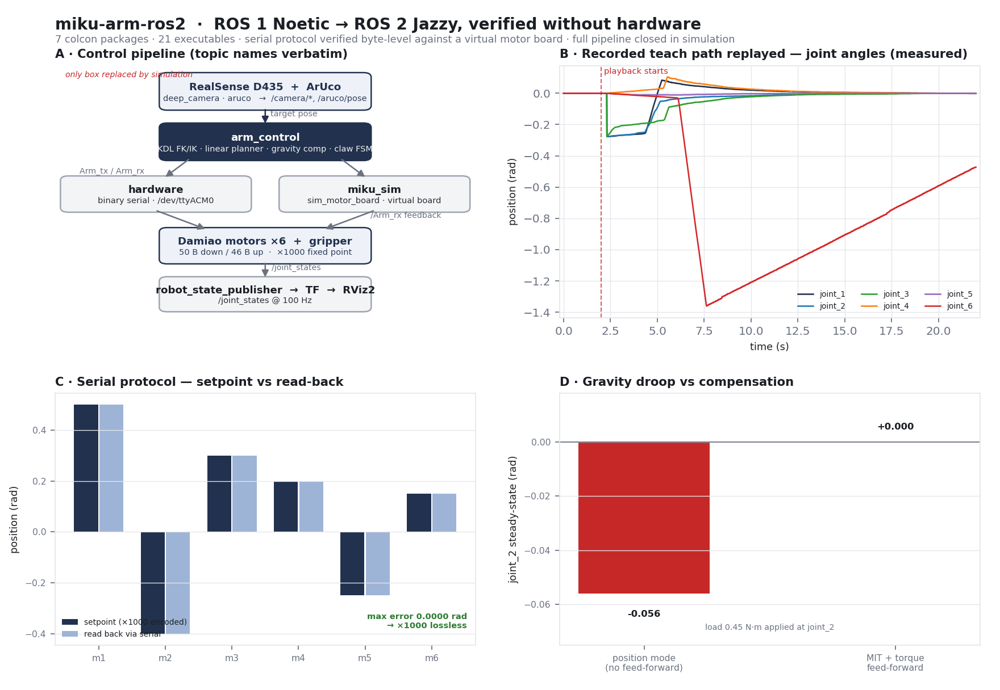

<div align="center">

# miku-arm-ros2

**A Damiao-motor 6-axis arm + gripper, moved from ROS 1 Noetic to ROS 2 Jazzy — and verified without the robot**

<sub>catkin → ament · <b>roscpp</b> → rclcpp · binary serial protocol reproduced byte-for-byte · closed loop in simulation</sub>

[](https://docs.ros.org/en/jazzy/)
[](#quick-start)
[](https://en.cppreference.com/w/cpp/17)
[](#quick-start)
[](#verification)
[](#verification)
[](LICENSE)

[Quick start](#quick-start) &nbsp;•&nbsp; [Why a port](#why-a-port) &nbsp;•&nbsp; [Architecture](#architecture) &nbsp;•&nbsp; [Verification](#verification) &nbsp;•&nbsp; [Simulation](#simulation-without-hardware) &nbsp;•&nbsp; [Docs](#documentation)

*English &nbsp;|&nbsp; [中文](README_CN.md)*

</div>



*Four panels, all from real runs. **A** the control pipeline with topic names verbatim. **B** joint
angles while a recorded teach path plays back through the simulated arm — 2 201 frames at 100 Hz;
`joint_6` sweeps 1.36 rad, the small step at t = 7.5 s is the trajectory's own discontinuity, not a
filter. **C** the ×1000 fixed-point serial encoding round-tripping with 0.0000 rad error. **D** a
0.45 N·m gravity load moving `joint_2` 0.056 rad in position mode and 0.000 rad under MIT with
torque feed-forward.*

This is the ROS 2 rebuild of a working ROS 1 arm controller. The arm is six Damiao motors plus a
gripper on one MCU driver board, spoken to over `/dev/ttyACM0` with a 50-byte down / 46-byte up
binary protocol. The original is kept verbatim in `reference/ros1-original/`; everything under
`src/` is the Jazzy port.

| | |
|---|---|
| **Port scope** | 5 catkin packages → 7 ament packages · **21 executables** · 8 082 lines of C++ |
| **Serial protocol** | **7/7** checks against a byte-faithful virtual driver board — no hardware |
| **Closed loop** | **6/6** end-to-end checks in simulation, `/joint_states` at **100 Hz** |
| **Teach path** | **38 610 lines** of real recordings replay through the simulated arm |
| **Behaviour preserved** | every threshold, gain and frame offset kept; 3 upstream bugs fixed, listed below |
| **Not verified** | the physical arm — real stiffness, friction and true gravity load · RealSense hardware |

---

## Why a port

The original is a ROS 1 Noetic catkin workspace. Noetic is not supported on Ubuntu 24.04 and cannot
be installed here, so the code was moved to ROS 2 Jazzy rather than rehosted.

The port is a translation, not a redesign. Where ROS 2 genuinely has no equivalent the change is
marked `// ROS 2 差异：` in the source and explained in [`docs/PORTING.md`](docs/PORTING.md).

Two upstream bugs were fixed on the way, both of which had silently disabled a feature:

| Where | Was | Now |
|---|---|---|
| `hardware.cpp` | `catch (SerialException&)` before `catch (IOException&)` made the latter unreachable | order swapped, so a vanished device reports as an I/O fault |
| `aruco` | `topic_marker_remove` was read into the *register* variable, so marker removal never worked | each parameter reads into its own variable |

A third is a genuine API change rather than a bug: `KDL::Tree::getChain` returns `bool` in orocos_kdl
1.5 where it used to return `int`, so the old `< 0` failure test was always false.

## Architecture


The original never went through MoveIt or `ros2_control`. It runs its own KDL forward/inverse
kinematics with straight-line interpolation and commands the motors directly in MIT mode — position
stiffness plus a gravity feed-forward torque. That matters for testability: the whole controller is
ordinary ROS nodes over two topics, so substituting the motor board substitutes the *entire*
difference between real and simulated.

| Topic | Type | |
|---|---|---|
| `Arm_tx` | `arm_control/msg/ArmMsg` | setpoints down: 7 motors × position / velocity / torque, plus `kp`, `kd`, mode |
| `Arm_rx` | `arm_control/msg/ArmMsg` | measured state up, at the driver board's rate |
| `/joint_states` | `sensor_msgs/msg/JointState` | 100 Hz, from the arm's read-back |

Two modes carry the design. `mode=2` is velocity-limited position control, used for homing and
trajectory replay. `mode=1` is MIT: with `kp = 0` the arm is back-drivable and the gravity
compensator alone holds it up, which is how teaching works — you move the arm by hand, and 1 kHz
recording captures the path.

## Quick start

```bash
source /opt/ros/jazzy/setup.bash          # required first: provides ros2 and colcon
git clone https://github.com/p20030920p/miku-arm-ros2.git
cd miku-arm-ros2
colcon build --symlink-install            # build from the repo root
source install/setup.bash                 # per-shell; re-run in every new terminal
```

No hardware required — start the simulated arm and its display:

```bash
ros2 launch miku_sim sim.launch.py                     # simulated motors + RViz2
ros2 launch miku_sim sim.launch.py use_rviz:=false      # headless

# in another terminal: replay a real recorded teach path through it
ros2 run hardware trajectory_track                      # prompts for a file in teach_path/
```

Against the real arm, the same nodes with the serial device in place:

```bash
ros2 launch miku_dummy display.launch.py      # robot_state_publisher + RViz2
ros2 run hardware hardware                    # serial node; -p serial_port:=/dev/ttyACM0
ros2 run arm_control teach_one_node           # hand-guiding with gravity compensation only
```

Or use the one-shot scripts, which also home the arm on exit:

```bash
./launch_hardware.sh                # display + serial node
./launch_arm_teach_one_node.sh      # + teaching node
./launch_claw_test.sh               # + gripper cycling
```

## Verification

The arm is not available, so the two things that could not otherwise be checked were reproduced
instead: the driver board, and the arm.

### The serial protocol — against a virtual driver board

`virtual_motor_board.py` implements the other end of the wire: frame headers `0x86C1` / `0x86C2`,
50- and 46-byte frames, field offsets, and the ×1000 fixed-point encoding. Paired over a `socat`
PTY, it lets the **real `hardware` binary** run unmodified.

```bash
ros2 run miku_sim run_serial_hil_test.sh
```

| Check | Result |
|---|---|
| Serial opens and initialises | ✅ |
| Bidirectional frame flow, 207 messages read back on `/Arm_rx` | ✅ |
| Position mode, 6 joints hold setpoint — **max error < 0.002 rad** | ✅ |
| MIT mode torque feed-forward, signs and magnitudes (+0.5 / −0.5 / +0.25 N·m) | ✅ |
| Gravity droop in position mode (−0.056 rad) removed by feed-forward (0.000 rad) | ✅ |
| Gripper stalls on contact at −1.2 rad with torque rising to 0.6 N·m | ✅ |
| Unplugging the board mid-run does not kill the node | ✅ |

That last one is the scenario the original code was written around: the MCU resets, the port throws
`IOException`, and the node must close and reconnect rather than die.

### The control pipeline — in simulation

```bash
ros2 run miku_sim run_sim_e2e_test.sh
```

| Check | Result |
|---|---|
| Simulation link up, `/joint_states` at **100 Hz** | ✅ |
| TF tree complete, `base_link → link_1 … → link_6` | ✅ |
| `arm_control_node` IK closed loop: target pose → IK → **arm actually moves** (0.056 rad) | ✅ |
| `teach_one_node` holds attitude under load — **0.0000 rad drift** over 12 s | ✅ |
| A real teach file replays: **7 325 points loaded, 2 229 commanded** | ✅ |
| Gripper state machine reaches *grasped* on contact | ✅ |

### What is *not* verified

Being explicit, because these matter:

- **The physical arm.** The protocol is verified byte-for-byte and the control law is verified in
  simulation, but real motor stiffness, friction, and the true gravity load are not. The gains in
  `arm_control_params.yaml` were hand-tuned on the real arm and are unchanged, so they should still
  be right — that is a claim, not a measurement.
- **The RealSense D435.** No camera. `deep_camera` and `aruco` are built and were exercised against
  synthetic images (correct 750 mm depth readout, marker `ID=341` detected, full pose solved), but
  nothing has seen real sensor data.
- **Joint limits.** `KDL::ChainIkSolverPos_LMA` does not consider them, upstream or here. An
  unreachable target logs `IK 失败，本步跳过` and is skipped. This is inherited behaviour, deliberately
  not "improved".
- **Graphical window interaction.** This machine's Qt5 highgui creates no X window even for a
  fifteen-line non-ROS `imshow` program, so mouse-pick and ESC paths in `deep_camera` were never
  clicked. The code paths are preserved 1:1.

## Simulation without hardware

`miku_sim` holds both substitutes. They answer different questions and are deliberately separate:

| | Questions it answers | Mechanism |
|---|---|---|
| `virtual_motor_board.py` | *Is the serial protocol right?* | sits on the far side of a PTY, speaks the real framing — the actual `hardware` binary is under test |
| `sim_motor_board` | *Is the control law right?* | replaces the board on the ROS side, publishes `/joint_states` so RViz2 and TF show the arm move |

Both model gravity as a load at `joint_2` and `joint_3`, and both stall the gripper on contact.
Gravity is modelled in position mode too — as a stiffness-limited steady-state droop — because
without that the gravity compensator has nothing to compensate and the test proves nothing. That was
a real defect in the first version of the simulator and is why the droop appears in panel D.

`gz sim` 8.11 is installed and runs, but `gz_ros2_control`'s `GazeboSimSystem` is only registered
inside the `gz-sim` process and cannot be loaded by a standalone `controller_manager` (`plugin does
not exist`). Since the original never used `ros2_control`, dropping it costs nothing and keeps the
simulated path identical to the real one.

## Layout

```
src/
  arm_control/                KDL FK/IK · linear planner · gravity compensator · claw FSM
  hardware/                   serial node + trajectory replay + teaching record + test nodes
  miku_sim/                   virtual driver board, simulated motors, both test suites
  miku_dummy/                 URDF, meshes, RViz2 config
  miku_dummy_moveit_config/   MoveIt 2 config (SRDF + planner params; MoveIt 1 launch files replaced)
  aruco/                      ArUco detector, ROS 2 node, marker-production material
  deep_camera/                RealSense RGB-D capture, pose estimation, visual grasping
docs/                         PORTING.md, TESTING.md, figures/
reference/ros1-original/      the ROS 1 workspace, unmodified, for comparison
tools/                        figure generators, joint-state capture
```

The `reference/` tree carries a `COLCON_IGNORE` so its ROS 1 packages do not collide with the port.

## Documentation

| | |
|---|---|
| [`docs/PORTING.md`](docs/PORTING.md) | the ROS 1 → ROS 2 mapping rules used throughout, and every place they did not apply |
| [`docs/TESTING.md`](docs/TESTING.md) | how to run both suites, what each check asserts, and how to re-capture the figures |

## License

MIT. The bundled `aruco` detector is MIT, © 2017 Tentone — see [`src/aruco/LICENSE`](src/aruco/LICENSE).
