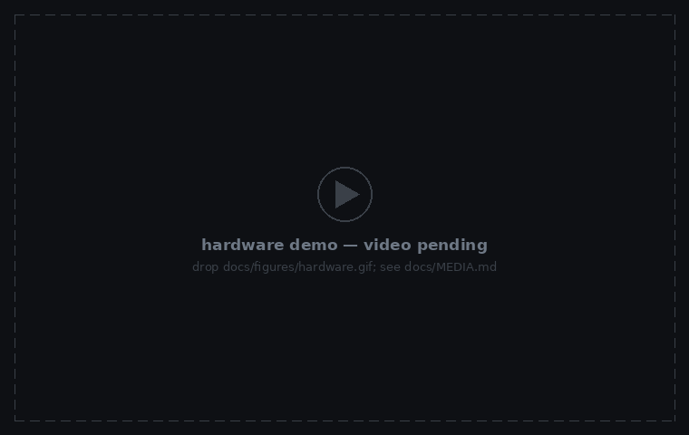
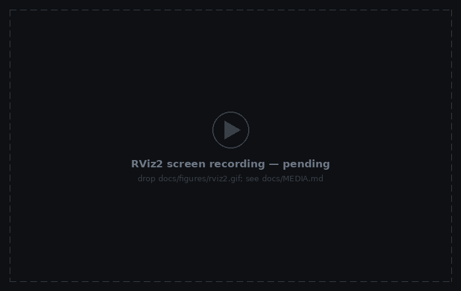
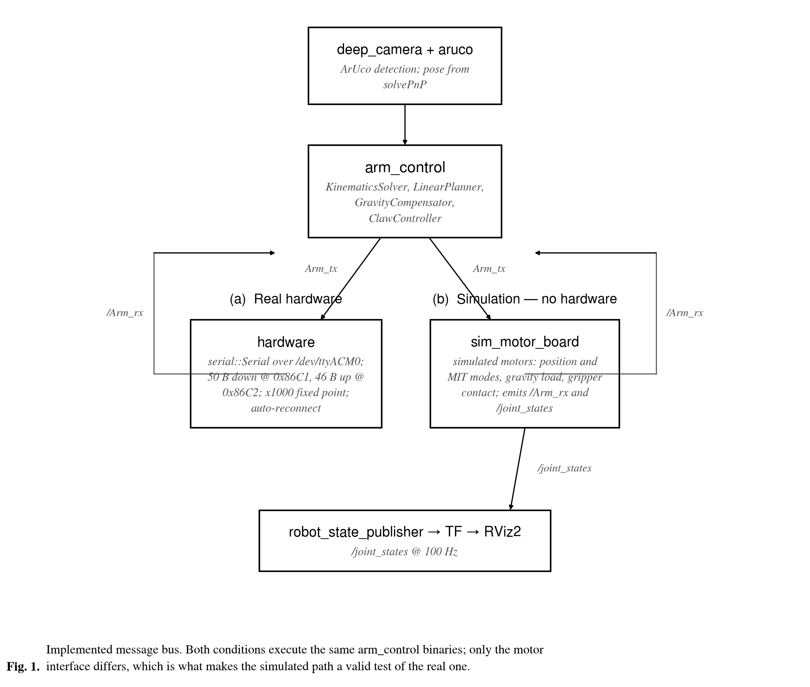

<div align="center">

# miku-arm-ros2

**达妙电机六轴机械臂，从 ROS 1 Noetic 移植到 ROS 2 Jazzy —— 并在没有实机的情况下完成验证**

<sub>catkin → ament · <b>roscpp</b> → rclcpp · 逐字节复现驱动板二进制协议 · 整条链路在仿真中闭环</sub>

[](https://docs.ros.org/en/jazzy/)
[](#快速开始)
[](https://en.cppreference.com/w/cpp/17)
[](#快速开始)
[](#验证)
[](#验证)

[快速开始](#快速开始) &nbsp;•&nbsp; [两个替代品](#两个替代品) &nbsp;•&nbsp; [验证](#验证) &nbsp;•&nbsp; [文档](#文档)

*[English](README.md) &nbsp;|&nbsp; 中文*

</div>

<p align="center">
  
</p>

*仿真。真实录制的示教轨迹在机械臂上回放 —— 网格是机器人自己的 URDF，位姿来自回放过程中
真实的 `/joint_states`：50 秒、100 Hz、六个关节全部在动。没有任何一帧是手工摆出来的。*

<p align="center">
  
  &nbsp;
  
</p>

*实物（左）与 RViz2 实时界面（右）—— 把录像放进对应文件即可生效，见
[`docs/MEDIA.md`](docs/MEDIA.md)。*

六个达妙电机加一个夹爪，挂在同一块 MCU 驱动板上，通过 `/dev/ttyACM0` 用「下行 50 字节 /
上行 46 字节」的二进制协议通信。原始 ROS 1 工程原样保留在 [`reference/`](reference/)，
`src/` 下是 Jazzy 移植版。

| | |
|---|---|
| **移植** | 5 个 catkin 包 → 7 个 ament 包 · 21 个可执行文件 |
| **协议** | **7/7** 项通过，六关节精度 **< 0.002 rad** |
| **链路** | 端到端 **6/6** 项通过，**100 Hz** |
| **保持一致** | 增益与帧偏移未改；修正 3 处上游缺陷 |
| **未验证** | 实机 · RealSense · 图形界面 —— 见[下文](#未验证的部分) |

## 快速开始

```bash
source /opt/ros/jazzy/setup.bash
git clone https://github.com/p20030920p/miku-arm-ros2.git && cd miku-arm-ros2
colcon build --symlink-install
source install/setup.bash
```

**不需要硬件** —— 启动仿真机械臂，再把真实录制回放上去：

```bash
ros2 launch miku_sim sim.launch.py                    # 仿真电机 + RViz2
ros2 run hardware trajectory_track                    # 提示输入 teach_path/ 下的文件名
```

接实机时用的是同一批节点，只是把串口设备接上：

```bash
ros2 launch miku_dummy display.launch.py              # robot_state_publisher + RViz2
ros2 run hardware hardware                            # -p serial_port:=/dev/ttyACM0
ros2 run arm_control teach_one_node                   # 重力补偿下手动示教
```

三个 `./launch_*.sh` 脚本封装了以上流程，并在退出时自动归零。

## 两个替代品

实机不可用，所以把两件否则无法检查的事各自替换掉了。它们回答不同的问题，因此**有意分开**。

**`virtual_motor_board.py` —— 串口协议对不对？** 它实现导线的另一端：`0x86C1` / `0x86C2`
帧头、字段偏移、×1000 定点。通过 `socat` 的 PTY 配对后，**真正的 `hardware` 二进制**
不加修改地跑在上面。

**`sim_motor_board` —— 控制律对不对？** 它在 ROS 侧替换驱动板，发布 `/joint_states`，
于是整条链路在仿真里闭环，RViz2 里能看到机械臂运动。



*只有高亮的那个方框被替换。两种路径下每个算法节点都是同一个二进制。*

原工程从不经过 MoveIt 或 `ros2_control` —— 它自己跑 KDL 运动学、以 MIT 模式直接下发电机指令。
正因如此，替换一个方框就足以测试整条链路。

## 验证

```bash
ros2 run miku_sim run_serial_hil_test.sh    # 7 项
ros2 run miku_sim run_sim_e2e_test.sh       # 6 项
```

`run_serial_hil_test.sh` —— 真实 `hardware` 二进制对虚拟驱动板：

| 检查项 | 结果 |
|---|---|
| 驱动板初始化、双向帧流 | ✅ |
| 六关节定位精度 | **< 0.002 rad** |
| MIT 力矩前馈符号与幅值 | ✅ |
| 重力下垂被前馈消除 | ✅ |
| 夹爪接触后卡住 | ✅ |
| 运行中拔掉驱动板 | 节点不退出 |

`run_sim_e2e_test.sh` —— 整条链路在仿真中闭环：

| 检查项 | 结果 |
|---|---|
| `/joint_states` 频率 | **100 Hz** |
| TF 树 `base_link → link_6` | 完整 |
| IK 闭环使机械臂真的运动 | ✅ |
| 重力补偿悬停漂移 | **0.0000 rad** |
| 真实示教文件回放 | **7 325 点** |
| 夹爪状态机到达「已夹到」 | ✅ |

定位精度那一项对移植最关键：字节序、字段偏移或 ×1000 约定只要错一处，都会在这里表现为固定偏差。

### 未验证的部分

- **实机物理特性。** 协议已验证到字节级、控制律已在仿真中验证，但真实刚度、摩擦与真实重力
  负载**没有**验证。`arm_control_params.yaml` 里的增益是在实机上手工标定的，本次未改动 ——
  这是判断，不是测量。
- **RealSense D435。** 没有相机。`deep_camera` 与 `aruco` 能编译，并用合成图像验证过
  （750 mm 深度、识别出标记 `ID=341`、解出完整位姿），但没有接触真实传感器数据。
- **关节限位。** `KDL::ChainIkSolverPos_LMA` 不考虑限位，上游如此、此处亦然。不可达目标会打印
  `IK 失败，本步跳过` 并被跳过 —— 这是继承来的行为，有意不去「改进」。
- **图形界面交互。** 本机 Qt5 highgui 起不了 X 窗口，所以 `deep_camera` 里的鼠标取点与
  ESC 退出路径从未被点击过。

## 目录结构

```
src/
  arm_control/               KDL 正逆解、直线规划、重力补偿、夹爪状态机
  hardware/                  串口节点、轨迹复现、示教录制、各测试节点
  miku_sim/                  虚拟驱动板、仿真电机、两套自动化测试
  miku_dummy/                URDF、meshes、RViz2 配置
  miku_dummy_moveit_config/  MoveIt 2 配置（SRDF + 规划器参数）
  aruco/                     检测器、ROS 2 节点、标记制作资料
  deep_camera/               RealSense RGB-D 采集、位姿估计
docs/                        PORTING.md、TESTING.md、OVERVIEW.md、MEDIA.md
reference/ros1-original/     原始 ROS 1 工作空间，未改动（COLCON_IGNORE）
tools/                       演示录制、配图生成、实物视频导入
```

## 文档

| | |
|---|---|
| [`docs/OVERVIEW.md`](docs/OVERVIEW.md) | 为什么移植、机械臂做什么、两个替代品如何工作 |
| [`docs/PORTING.md`](docs/PORTING.md) | ROS 1 → ROS 2 映射规则，以及每一处不适用之处 |
| [`docs/TESTING.md`](docs/TESTING.md) | 每项断言检查什么、配图如何重新录制 |
| [`docs/MEDIA.md`](docs/MEDIA.md) | 如何加入实物录像；两个预留位置 |
| [`CHANGELOG.md`](CHANGELOG.md) | 含修正的三处上游缺陷 |

## 许可

MIT。随包附带的 ArUco 检测器为 MIT，© 2017 Tentone —— 见 [`src/aruco/LICENSE`](src/aruco/LICENSE)。
