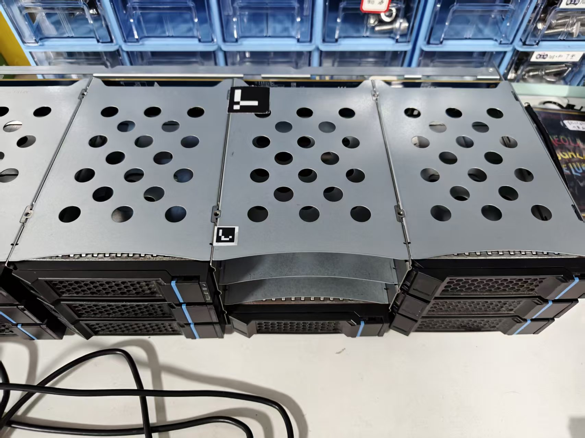

#### aruco码 0~1023

1. 服务器柜子（1cm）4个
   1. 第一列柜子 `001`
   2. 第二列柜子 `002`
   3. 第三列柜子 `003`
   4. 第四列柜子 `004`
2. 硬盘（3*12=36个）
   1. 硬盘（1，1）  （行，列）
      1. 宽面（3cm）
         1. 左 `111`
         2. 右 `112`
      2. 窄面（1cm）`113`
   2. 硬盘（1，2）
      1. 宽面（3cm）
         1. 左 `121`
         2. 右 `122`
      2. 窄面（1cm）`123`
   3. 硬盘（3，4）
      1. 宽面（3cm）
         1. 左 `341`
         2. 右 `342`
      2. 窄面（1cm）`343`

## 性价比测试套件：

- 服务器柜子4个

  1、2、3、4

- 硬盘4*3=12个

  - 硬盘（1，2）
    - 121、122、123
  - 硬盘（1，3）
    - 131、132、133
  - 硬盘（2，2）
    - 221、222、223
  - 硬盘（2，3）
    - 231、232、233

备份3套，**总计：**16*3=48个

## 全面测试套件

- 服务器柜子4个

  1、2、3、4

- 硬盘12*3=36个

备份3套，**总计：**40*3=120个
